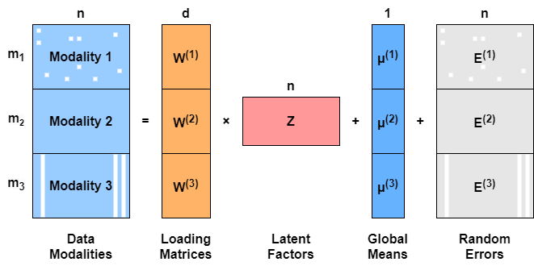

<!-- README.md is generated from README.Rmd. Please edit that file -->

## R package: GPCCA

The `GPCCA` package provides functions to implement Generalized Probabilistic 
Canonical Correlation Analysis (GPCCA) on multi-modal dataset. GPCCA is 
an unsupervised method designed to perform data integration and joint 
dimensionality reduction on a dataset consisting of multiple modalities.


## Installation

The package can be installed from GitHub with:

``` r
devtools::install_github("Kaversoniano/GPCCA")
```

A tutorial of GPCCA comes as a built-in vignette with 
the installed package:

``` r
devtools::install_github("Kaversoniano/GPCCA", build_vignettes = TRUE)
```


## GPCCA model

GPCCA is a probabilistic model built based on the Gaussian latent variable 
framework, serving as an extension of the probabilistic CCA (PCCA) with 
several key merits:

- It generalizes PCCA from two to more than two modalities.
- It learns joint low-dimensional embeddings probabilistically.
- It imputes missing values inherently during its parameter estimation.

GPCCA is capable of handling incomplete data with various patterns of 
missing values. See below for an illustration of the GPCCA model applied 
to a three-modality dataset. White boxes are used to indicate missing 
data and the missing pattern of each data modality is described as follows:

1.  Modality 1 contains random missing values
2.  Modality 2 is fully observed and complete
3.  Modality 3 involves modality-wise missingness





## Usage

``` r
vignette("tutorial", package = "GPCCA")
```

Please see the package vignette for:

- Generation of example multi-modal datasets
- How to fit the GPCCA model on a multi-modal dataset
- How to extract the **learned latent factors\**
- Example downstream analysis on the **joint latent embeddings\**
- Visualizations of the **low-dimensional embeddings\**
- Model selection on the target dimension, i.e., the number of latent factors


## Key functions

### `GPCCAmodel`

`GPCCAmodel` is the primary function for users. It implements GPCCA and fit it 
to a multi-modal dataset, which generates the joint low-dimensional embeddings. 
For high-dimensional data, feature selection is strongly recommended so 
that only the highly informative features are included in the model fit. 
This helps to reduce the computational resources required and boost the 
computational speed.

### `GPCCAselect`

`GPCCAselect` provides a built-in technique of model selection on 
target dimension (hyper-parameter). Its output gives the optimal choice(s) 
of the target dimension based on a given set of candidate values.

### `GPCCAmodel2`

`GPCCAmodel2` is another primary function for users. It implements GPCCA 
extension models: GPCCA-Pois and GPCCA-Bern, where 
GPCCA-Pois is designed for multi-modal count data and 
GPCCA-Bern is designed for multi-modal binary data. By contrast, 
the original GPCCA model is developed for general continuous data, 
which is implemented in a separate framework by `GPCCAmodel`.