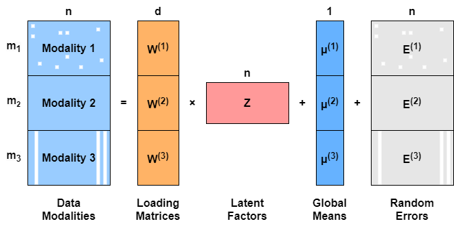

<!-- README.md is generated from README.Rmd. Please edit that file -->

## R package: GPCCA

A package that provides functions to implement Generalized Probabilistic
Canonical Correlation Analysis (GPCCA) on multi-modal dataset. GPCCA is
an unsupervised method designed to perform data integration and joint
dimensionality reduction on a dataset consisting of multiple modalities.
It bears the potential to effectively learn both shared and
complementary information across modalities.

## Installation

The package can be installed from GitHub with:

``` r
devtools::install_github("Kaversoniano/GPCCA")
```

A tutorial of how to implement GPCCA comes as a built-in vignette with
the installed package:

``` r
devtools::install_github("Kaversoniano/GPCCA", build_vignettes = TRUE)
```

## A tutorial of usage

``` r
vignette("tutorial", package = "GPCCA")
```

See the package vignette for:

- Example multi-modal datasets provided by the package
- How to fit GPCCA model to a multi-modal dataset
- How to extract the **fitted latent factors\***
- Example downstream analysis on the **resulting projections\***
- Visualizations of the **joint low-dimensional embeddings\***
- Model selection on target dimension, i.e. the number of latent factors

*Note:* The keywords in bold marked by **\*** share the same meaning
under the framework of GPCCA and they are used interchangeably.

## GPCCA model

GPCCA is a probabilistic framework built on Gaussian latent variable
model, serving as an extension of the probabilistic CCA (PCCA) with
several key merits:

- It generalizes PCCA from two to more than two modalities.
- It learns joint low-dimensional embeddings probabilistically.
- It imputes missing values inherently during its parameter estimation.

GPCCA is capable of handling incomplete data with various patterns of
missing values. See below for an illustration of the GPCCA model applied
to a three-modality dataset. White boxes are used to indicate missing
data and the missing pattern of each data modality is described as
follows:

1.  Modality 1 contains random missing values
2.  Modality 2 is fully observed and complete
3.  Modality 3 involves modality-wise missingness

Although, in this example, each modality has a distinct pattern of
missingness, GPCCA can handle real data with a mixture of different
missing patterns.



## Key functions

### `GPCCAmodel`

`GPCCAmodel` is the primary function for end users. It implements GPCCA
and fit it to a general multi-modal dataset, which generates one of its
key outputs: the joint low-dimensional embeddings. The reconstructed
data representations learnt by GPCCA can be directly used for further
downstream analysis of users’ preference.

For high-dimensional data, feature selection is strongly recommended so
that only the highly informative features are included in the model fit.
This helps to reduce the computational resources required and boost the
computational speed.

### `GPCCAselect`

`GPCCAselect` is the secondary function for end users. It provides a
built-in technique of model selection on target dimension
(hyper-parameter). Its output gives the optimal choice(s) of the target
dimension based on a given set of candidate values.

The proposed model selection framework is computationally intensive when
the dimensionality of data is considerably high. Thus it is recommended
to perform such model selection on a subset of data samples using highly
informative features only.
